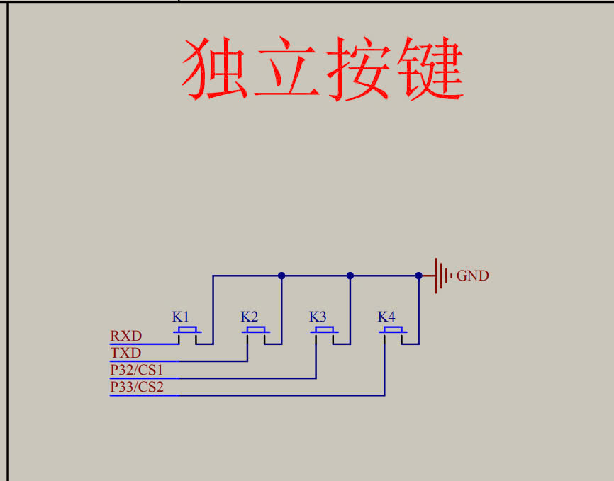
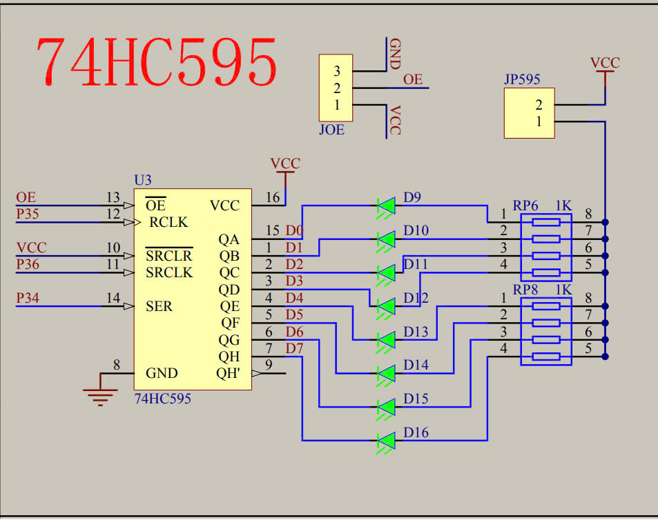
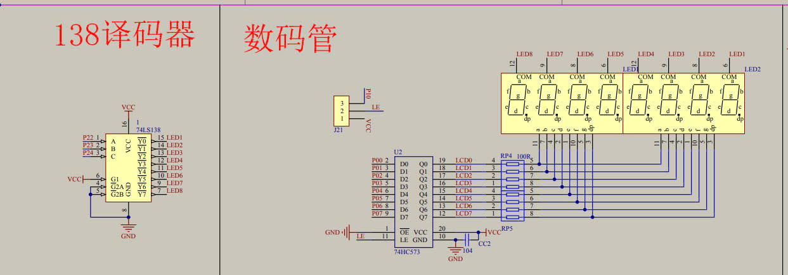

# kit8051_mophongdengiaothong
## sử dụng P32 để chuyển chế dộ chỉnh thủ công sang auto và ngược lại

## điều khiển led ma trận để mô phỏng đèn giao thông
ic 74hc595 nhận dữ liệu nối tiếp từ p35 mà xuất ra ngõ ra 

## điều khiển và hiển thị led 7 đoạn để mô phỏng bộ đếm
ic74ls138 có chức năng chọn led hiểu thị từ 3 chân p22, p23, p24 thành 8 ngõ ra khác nhau
